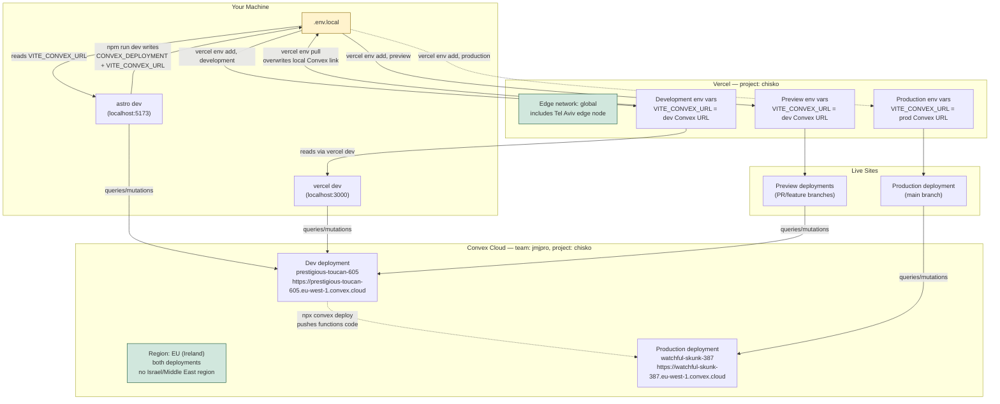

# Deployment Topology: Convex + Vercel

How local dev, Convex deployments, Vercel environments, and the commands that
touch each of them map together.

## Key facts

1. **Two Convex deployments exist, both cloud, both EU (Ireland).** A dev
   deployment (`prestigious-toucan-605`) used by `npm run dev` and by
   Vercel's Preview/Development environments, and a production deployment
   (`watchful-skunk-387`) used only by Vercel's Production environment. There
   is no local-only Convex backend anymore — `npm run dev` now syncs against
   the cloud dev deployment.

2. **`.env.local` is contested ground.** `npx convex dev` writes the dev
   deployment's URL into it. `vercel env pull` overwrites it with whatever's
   configured in Vercel's `development` environment — which now happens to
   be the same dev deployment URL, so the two no longer fight over the
   *value*, but `vercel env pull` still drops the `CONVEX_DEPLOYMENT` line
   convex needs for `npx convex deploy` to find the right project. If that
   happens, re-run `npx convex dev --once` to restore it.

3. **Preview and Development share one Convex deployment; only Production
   gets its own.** PR preview deployments and your `vercel dev`/local work
   write to the same dev Convex deployment and data. Production data is
   isolated in `watchful-skunk-387`.

4. **`npx convex deploy`** only pushes `convex/` functions/schema to the
   project's default production deployment. It never touches `.env.local` or
   Vercel env vars.

5. **`vercel dev`** talks to whatever `VITE_CONVEX_URL` Vercel's Development
   environment has configured — currently the dev Convex deployment, so this
   now matches local `npm run dev` behavior.

6. **Region: both Convex deployments are in EU (Ireland); Vercel's edge is
   global, including Tel Aviv.** Convex Cloud only offers **US** and
   **EU/Ireland** (~30% cost premium over US) — no Israel/Middle East region.
   Choosing EU gets Israeli users roughly half the round-trip latency to
   Convex compared to US, though it's still a cross-region hop, not local.
   Vercel's CDN/edge serves static assets and middleware from the nearest
   edge regardless (e.g. Tel Aviv), so only the Convex query/mutation leg is
   affected by this region choice.

## Common commands

| Command | What it does |
| --- | --- |
| `npm run dev` | Starts Astro dev synced against the cloud dev Convex deployment, writes its config to `.env.local`. |
| `npx convex deploy` | Pushes `convex/` functions/schema to the production Convex deployment (`watchful-skunk-387`). |
| `npx convex deployment create --type <dev\|prod> --region <us\|eu>` | Creates a new Convex deployment in a given region. |
| `npx vercel env ls` | Lists env vars configured per Vercel environment. |
| `npx vercel env add <NAME> <env>` | Adds an env var to a Vercel environment (`production`, `preview`, `development`). For `preview` across all branches, pass an empty string as the git-branch argument. |
| `npx vercel env pull .env.local` | Pulls Vercel's env vars into `.env.local` — overwrites local Convex dev config. |
| `npx vercel dev` | Runs the app locally using Vercel's runtime + env vars (talks to the dev Convex deployment). |
