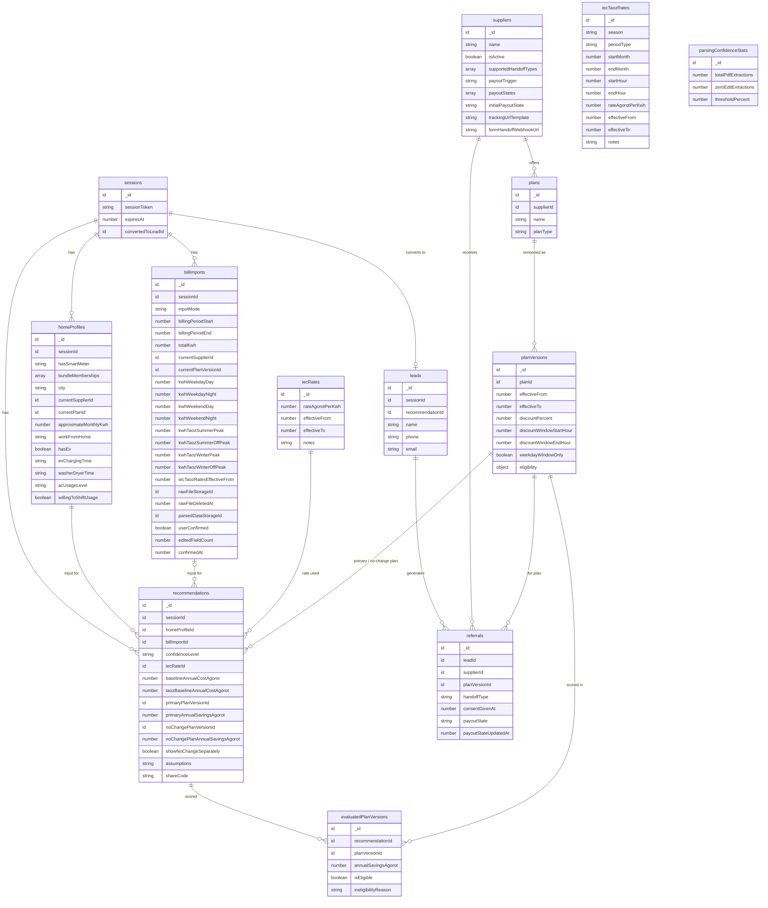

# Convex Schema — ER Diagram

> **To regenerate:** ask Claude Code: _"regenerate docs/schema-diagram.md from convex/schema.ts"_

```mermaid
erDiagram
    suppliers {
        id      _id
        string  name
        boolean isActive
        array   supportedHandoffTypes
        string  payoutTrigger
        array   payoutStates
        string  initialPayoutState
        string  trackingUrlTemplate
        string  formHandoffWebhookUrl
    }

    iecRates {
        id     _id
        number rateAgorotPerKwh
        number effectiveFrom
        number effectiveTo
        string notes
    }

    iecTaozRates {
        id     _id
        string season
        string periodType
        number startMonth
        number endMonth
        number startHour
        number endHour
        number rateAgorotPerKwh
        number effectiveFrom
        number effectiveTo
        string notes
    }

    plans {
        id     _id
        id     supplierId
        string name
        string planType
    }

    planVersions {
        id      _id
        id      planId
        number  effectiveFrom
        number  effectiveTo
        number  discountPercent
        number  discountWindowStartHour
        number  discountWindowEndHour
        boolean weekdayWindowOnly
        object  eligibility
    }

    sessions {
        id     _id
        string sessionToken
        number expiresAt
        id     convertedToLeadId
    }

    homeProfiles {
        id      _id
        id      sessionId
        string  hasSmartMeter
        array   bundleMemberships
        string  city
        id      currentSupplierId
        id      currentPlanId
        number  approximateMonthlyKwh
        string  workFromHome
        boolean hasEv
        string  evChargingTime
        string  washerDryerTime
        string  acUsageLevel
        boolean willingToShiftUsage
    }

    billImports {
        id      _id
        id      sessionId
        string  inputMode
        number  billingPeriodStart
        number  billingPeriodEnd
        number  totalKwh
        id      currentSupplierId
        id      currentPlanVersionId
        number  kwhWeekdayDay
        number  kwhWeekdayNight
        number  kwhWeekendDay
        number  kwhWeekendNight
        number  kwhTaozSummerPeak
        number  kwhTaozSummerOffPeak
        number  kwhTaozWinterPeak
        number  kwhTaozWinterOffPeak
        number  iecTaozRatesEffectiveFrom
        id      rawFileStorageId
        number  rawFileDeletedAt
        id      parsedDataStorageId
        boolean userConfirmed
        number  editedFieldCount
        number  confirmedAt
    }

    recommendations {
        id      _id
        id      sessionId
        id      homeProfileId
        id      billImportId
        string  confidenceLevel
        id      iecRateId
        number  baselineAnnualCostAgorot
        number  taozBaselineAnnualCostAgorot
        id      primaryPlanVersionId
        number  primaryAnnualSavingsAgorot
        id      noChangePlanVersionId
        number  noChangePlanAnnualSavingsAgorot
        boolean showNoChangeSeparately
        string  assumptions
        string  shareCode
    }

    evaluatedPlanVersions {
        id      _id
        id      recommendationId
        id      planVersionId
        number  annualSavingsAgorot
        boolean isEligible
        string  ineligibilityReason
    }

    leads {
        id     _id
        id     sessionId
        id     recommendationId
        string name
        string phone
        string email
    }

    referrals {
        id     _id
        id     leadId
        id     supplierId
        id     planVersionId
        string handoffType
        number consentGivenAt
        string payoutState
        number payoutStateUpdatedAt
    }

    parsingConfidenceStats {
        id     _id
        number totalPdfExtractions
        number zeroEditExtractions
        number thresholdPercent
    }

    suppliers        ||--o{ plans                 : "offers"
    plans            ||--o{ planVersions           : "versioned as"
    sessions         ||--o{ homeProfiles           : "has"
    sessions         ||--o{ billImports            : "has"
    sessions         ||--o{ recommendations        : "has"
    sessions         ||--o| leads                  : "converts to"
    homeProfiles     ||--o{ recommendations        : "input for"
    billImports      |o--o{ recommendations        : "input for"
    iecRates         ||--o{ recommendations        : "rate used"
    planVersions     ||--o{ recommendations        : "primary / no-change plan"
    recommendations  ||--o{ evaluatedPlanVersions  : "scored"
    planVersions     ||--o{ evaluatedPlanVersions  : "scored in"
    leads            ||--o{ referrals              : "generates"
    suppliers        ||--o{ referrals              : "receives"
    planVersions     ||--o{ referrals              : "for plan"
```
