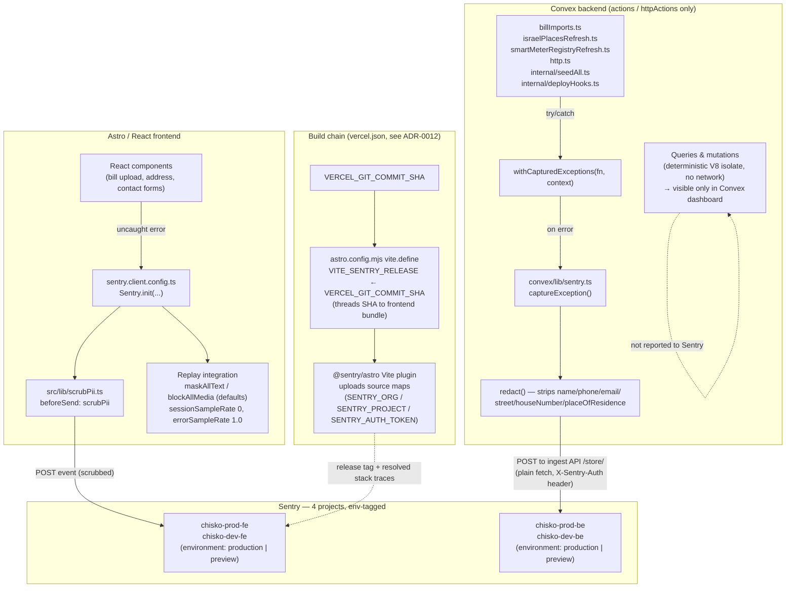

# Sentry Integration — Architecture Diagram

> Companion diagram for [`docs/adr/0013-sentry-scope-environments-and-pii-handling.md`](adr/0013-sentry-scope-environments-and-pii-handling.md).
> To regenerate: ask Claude Code to "regenerate docs/sentry-integration-diagram.md from ADR-0013 and the current Sentry wiring."

